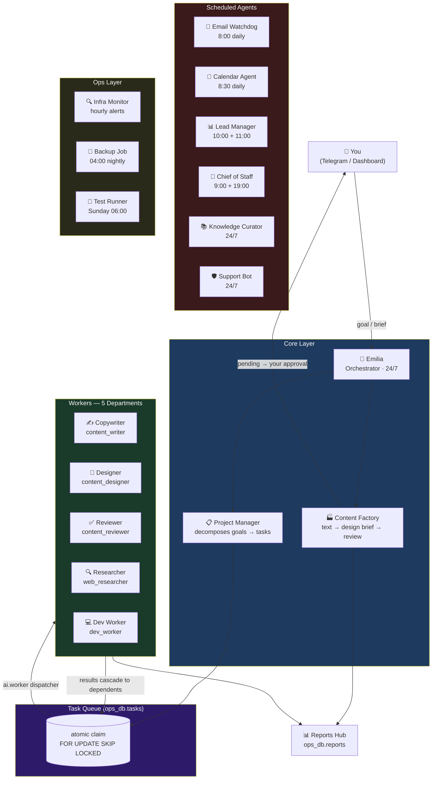

<div align="center">

# 🏢 Personal AI Operating System

**9 autonomous agents · 5 departments · runs 24/7 on a Mac Mini**

A real, production AI agent team that operates a commercial IoT startup — not a demo, not a toy.
Built from scratch in Python, running under macOS launchd, talking to Groq and a local Ollama GPU node.


</div>

---

## What this is

I needed a team to run [Amori](https://amori.online) — a GPS pet-collar startup.
Hiring people for every function isn't realistic early on, so I built one out of agents.

The system handles email, leads, customer support, content creation, task management, ops monitoring,
and knowledge curation. It generates sales content, reviews it, waits for my approval, then publishes.
It backs itself up nightly, tests itself weekly, and pages me on Telegram if something breaks.

**The rule:** agents do the work; I approve what ships.

---

## Architecture



---

## How a project runs

```
You: "make 3 posts about the collar for Telegram"
       ↓
Emilia calls new_project("3 Telegram posts about the collar")
       ↓
project_manager decomposes → 3 parallel chains:
  [copywriter] → [designer] → [reviewer]   (×3 posts)
       ↓
ai.worker drains the queue atomically (FOR UPDATE SKIP LOCKED)
  reviewer gets the copywriter's text AND designer's visual brief
  (transitive ancestor results via recursive CTE)
       ↓
3 posts land in Dashboard → "🏭 Content Factory"
       ↓
You click ✅ Publish → goes to Telegram channel
```

Total time: ~2–3 minutes. You spent ~5 seconds.

---

## System map

| Layer | What | Where |
|---|---|---|
| **Agent runtime** | 9 Python agents, shared libs | [`agents/`](agents/) |
| **MCP server** | 11 tools for Claude / Codex / Hermes | [`mcp/`](mcp/) |
| **Ops dashboard** | Web UI at :8099, direct psycopg2, no docker exec | [`dashboard/`](dashboard/) |
| **Pixel office** | Live agent visualization at :5070 | [`office-fork/`](office-fork/) |
| **Infrastructure** | Docker Compose: Postgres, Qdrant, Redis, Langfuse, n8n | [`docker-compose.yml`](docker-compose.yml) |
| **Docs** | Architecture, runbook, principles | [`docs/`](docs/) |

---

## Stack

| Concern | Technology |
|---|---|
| Agent language | Python 3.12, litellm / Groq SDK, praisonai |
| LLM routing | Groq (LLaMA 3.3 70B) · local Ollama GPU node (fallback) |
| Primary DB | PostgreSQL 16 — `ops_db` (ops) · `customer_db` (CRM, 152-ФЗ) · `agents` (memory) |
| Vector memory | Qdrant — collections `project_knowledge`, `shared_memory` |
| Scheduling | macOS launchd (11 jobs) + crontab (3 jobs) |
| MCP transport | FastMCP stdio — connects to Claude Code, Codex, Hermes |
| Notifications | Telegram Bot API (chunked, 3× retry on SSL errors) |
| Observability | ops_db: `llm_usage`, `infra_runs`, `infra_heartbeats`, `task_events` |
| Backups | pg_dump × 4 DBs + Qdrant snapshots → GPG-encrypted off-site |
| Cost control | `cost_guard.py` — monthly budget cap, auto-downgrade to free tier |

---

## Databases

```
ai_postgres (Docker)
├── ops_db          ← task queue, projects, content, reports, LLM usage, heartbeats
├── customer_db     ← leads, support tickets (152-ФЗ boundary, separate from ops)
├── agents          ← conversation history, Langfuse telemetry
└── n8n             ← workflow engine
```

---

## Interfaces

| Interface | URL | Purpose |
|---|---|---|
| **Dashboard** | `:8099` | Main control panel — projects, content factory (with approval flow), kanban, reports, team hierarchy, model/budget toggles |
| **Ambient view** | `:8099/office` | Lightweight CSS "office" — department wings, project/content pulse, report feed |
| **Pixel office** | `:5070` | React+Canvas office — agents as pixel characters at desks, light up on activity |
| **Docs** | `:8099/docs` | HOW_IT_WORKS.md rendered in browser |

---

## Launchd jobs

```
ALWAYS ON          ai.orchestrator  ai.worker  amori.support  knowledge.curator  ai.dashboard  ai.office
SCHEDULED          amori.backup (04:00)  ai.monitor (hourly)  ai.digest (Mon 09:00)
                   chief.of.staff (9:00+19:00)  email.watchdog (08:00)
                   ai.restoretest (1st of month)  ai.tests (Sun 06:00)
CRONTAB            task_sync (10:00)  calendar_agent (08:30)  lead_manager (10:00 + 11:00)
```

---

## Setup

```bash
git clone https://github.com/Lenis45/agent-os
cd agent-os

# 1. Infrastructure
docker compose up -d

# 2. Python deps (anaconda recommended)
pip install litellm praisonai psycopg2-binary python-dotenv groq \
            python-telegram-bot qdrant-client tenacity

# 3. MCP server deps
cd mcp && python -m venv .venv && .venv/bin/pip install "mcp[cli]" psycopg2-binary python-dotenv

# 4. Copy and fill env
cp agents/.env.example agents/.env   # add your Groq key, Telegram token, etc.

# 5. Init databases
cd agents && python ops_store.py

# 6. Run tests
python -m pytest tests/ -q           # expect 72 tests passing

# 7. Load launchd jobs (macOS)
# See docs/RUNBOOK.md for launchctl commands
```

---

## Tests

```bash
cd ~/ai-infra/agents
python -m pytest tests/ -q
# 72 tests: shared libs (parse_json, cost_guard, DB round-trips) +
#           agent smoke imports + regression guards (no hardcoded PG pw, no Langfuse(), correct DB contours)
```

---

*See [`docs/HOW_IT_WORKS.md`](docs/HOW_IT_WORKS.md) for a full walkthrough in Russian.*
