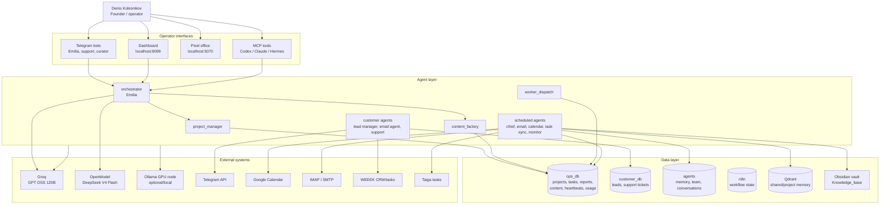
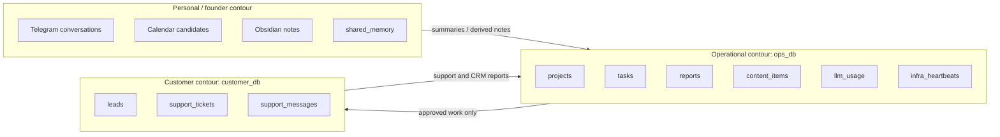
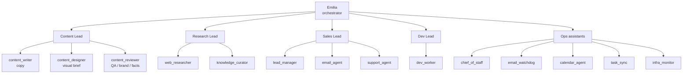
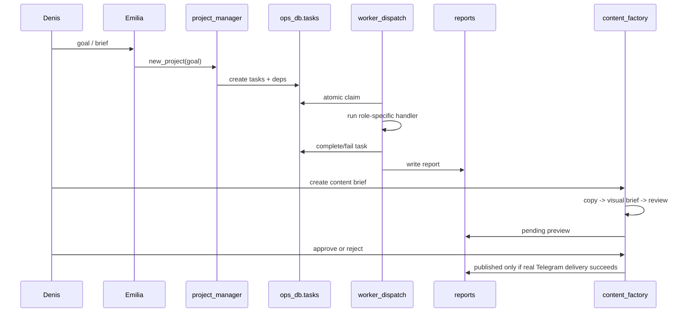

<div align="center">

# Amori AI Operating System

**Personal AI team for Denis Kolesnikov and the Amori pet-tech startup**

Local-first agent infrastructure for founder operations, SMM/content production,
CRM, support, knowledge management, monitoring, and backups.


</div>

---

## Executive Summary

This repository is the local production infrastructure for **Denis Kolesnikov**,
founder/operator of **Amori**. Amori is a pet-tech project building a GPS collar
product for pet owners. The repo does not contain product firmware or customer
secrets; it contains the private operating system that helps run the business.

The system is deliberately not "just another AI chat". It is a set of agents,
databases, dashboards, schedules, approval gates, audit trails, and recovery
scripts that let a small founder-led startup operate with a lightweight AI team.

**Core principle:** agents prepare and analyze work; Denis approves irreversible
actions such as publishing or outbound communication.

---

## Current State Snapshot

Last verified: **2026-07-09** on the local Mac host.

| Area | Current fact |
|---|---|
| Runtime | macOS launchd + Docker Compose |
| Containers | 5/5 up: Postgres, Qdrant, Redis, Langfuse, n8n |
| Dashboard | `http://localhost:8099` |
| Pixel office | `http://localhost:5070` |
| Agent dashboard status | 8/9 running/scheduled/on-demand in the control panel |
| Queue | No active queued tasks at last check |
| Tests | `90 passed` in `agents/tests` |
| Default Groq model | `groq/openai/gpt-oss-120b` |
| Paid API budget | 2500 RUB cap, current paid spend shown as 0.00 RUB |
| Restore test | Passing; latest backup restored into a disposable Postgres container |

Known operator items are documented instead of hidden:

| Item | Why it matters | Current handling |
|---|---|---|
| Google Calendar token | `calendar_agent` cannot modify Calendar with expired OAuth | Agent now fails closed and sends a warning instead of crashing |
| One IMAP account | `email_watchdog` sees `AUTHENTICATIONFAILED` for one mailbox | Other mailboxes still work; update the app password |
| Historical bad reports | Old June reports contain fake publication/product claims | New output contracts and tests block these patterns going forward |
| Telegram network noise | Telegram polling can emit transient SSL/EOF stack traces | Long-running bots recover under launchd / library retry loops |

---

## What The System Actually Does

| Capability | Real behavior today |
|---|---|
| Founder assistant | Telegram bot "Emilia" routes requests, answers questions, invokes tools, handles voice/photo/document input |
| Chief of Staff | Reads recent Telegram context and creates morning/evening digests |
| Email triage | Reads configured IMAP accounts and sends a concise digest of important email |
| Calendar assistant | Detects meeting candidates; modifies Google Calendar only when OAuth works and data is precise |
| Knowledge capture | Saves owner notes to Obsidian and shared memory with path safety checks |
| CRM / leads | Stores leads in `customer_db`, optionally mirrors to WEEEK when credentials are valid |
| Support bot | Handles customer support tickets in a separate customer data contour |
| SMM/content factory | Generates copy, visual brief, editorial review, and waits for human approval |
| Project queue | Decomposes goals into tasks and runs workers through a DB-backed queue |
| Monitoring | Tracks containers, launchd agents, heartbeats, backups, disk pressure, provider health |
| Backup / restore | Backs up Postgres/Qdrant/code and verifies restore using a disposable DB |

What it intentionally does **not** claim:

- It does not automatically publish marketing content without approval.
- It does not fabricate product capabilities such as real-time GPS precision,
  health monitoring, geofences, or ready mobile apps.
- It does not let the browser choose tenant, approval actor, or Telegram target.
- It does not directly edit external code repositories from `dev_worker`; dev
  output is proposed code/tests unless a real tool applies it.

---

## System Architecture


```mermaid
flowchart TB
    Denis["Denis Kolesnikov<br/>Founder / operator"]

    subgraph Interfaces["Operator interfaces"]
        TG["Telegram bots<br/>Emilia, support, curator"]
        Dash["Dashboard<br/>localhost:8099"]
        Office["Pixel office<br/>localhost:5070"]
        MCP["MCP tools<br/>Codex / Claude / Hermes"]
    end

    subgraph Agents["Agent layer"]
        Orchestrator["orchestrator<br/>Emilia"]
        PM["project_manager"]
        Factory["content_factory"]
        Worker["worker_dispatch"]
        Scheduled["scheduled agents<br/>chief, email, calendar, task sync, monitor"]
        Customer["customer agents<br/>lead manager, email agent, support"]
    end

    subgraph Data["Data layer"]
        OpsDB[("ops_db<br/>projects, tasks, reports,<br/>content, heartbeats, usage")]
        CustomerDB[("customer_db<br/>leads, support tickets")]
        AgentsDB[("agents<br/>memory, team, conversations")]
        N8NDB[("n8n<br/>workflow state")]
        Qdrant[("Qdrant<br/>shared/project memory")]
        Obsidian["Obsidian vault<br/>Knowledge_base"]
    end

    subgraph External["External systems"]
        Groq["Groq<br/>GPT OSS 120B"]
        OpenModel["OpenModel<br/>DeepSeek V4 Flash"]
        Ollama["Ollama GPU node<br/>optional/local"]
        Telegram["Telegram API"]
        Google["Google Calendar"]
        Mail["IMAP / SMTP"]
        Weeek["WEEEK CRM/tasks"]
        Taiga["Taiga tasks"]
    end

    Denis --> TG
    Denis --> Dash
    Denis --> Office
    Denis --> MCP

    TG --> Orchestrator
    Dash --> Orchestrator
    MCP --> Orchestrator
    Orchestrator --> PM
    Orchestrator --> Factory
    PM --> OpsDB
    Factory --> OpsDB
    Worker --> OpsDB
    Worker --> Agents
    Scheduled --> OpsDB
    Customer --> CustomerDB
    Scheduled --> AgentsDB
    Scheduled --> Qdrant
    Scheduled --> Obsidian

    Orchestrator --> Groq
    Orchestrator --> OpenModel
    Agents --> Groq
    Agents --> Ollama
    Customer --> Telegram
    Scheduled --> Google
    Scheduled --> Mail
    Customer --> Weeek
    Scheduled --> Taiga
```

---

## Data Contours

The system keeps operational, customer, and personal data separated because the
same local infrastructure handles both founder workflows and customer-facing
automation.


```mermaid
flowchart LR
    subgraph Personal["Personal / founder contour"]
        TelegramDM["Telegram conversations"]
        Calendar["Calendar candidates"]
        Notes["Obsidian notes"]
        Memory["shared_memory"]
    end

    subgraph Ops["Operational contour: ops_db"]
        Projects["projects"]
        Tasks["tasks"]
        Reports["reports"]
        Content["content_items"]
        Usage["llm_usage"]
        Heartbeats["infra_heartbeats"]
    end

    subgraph Customer["Customer contour: customer_db"]
        Leads["leads"]
        Tickets["support_tickets"]
        Messages["support_messages"]
    end

    Personal -->|summaries / derived notes| Ops
    Ops -->|approved work only| Customer
    Customer -->|support and CRM reports| Ops
```

### PostgreSQL databases

| DB | Purpose | Examples |
|---|---|---|
| `ops_db` | Operations and observability | `projects`, `tasks`, `reports`, `content_items`, `agent_registry`, `llm_usage`, `infra_runs`, `infra_heartbeats` |
| `customer_db` | Customer and lead data | `leads`, `support_tickets`, `support_messages`, `support_faq` |
| `agents` | Personal/team memory and historical agent tables | `team_members`, `known_entities`, `chief_digests` |
| `n8n` | Workflow engine state | n8n internal tables |

### Non-Postgres stores

| Store | Data |
|---|---|
| Qdrant | `shared_memory`, `project_knowledge` vectors |
| Obsidian vault | Founder notes, translated tasks, knowledge capture |
| Local files | launchd plists, Telegram sessions, logs, backups |
| External APIs | Telegram, Google Calendar, IMAP/SMTP, WEEEK, Taiga, LLM providers |

Secrets live in untracked env/session files. README files intentionally document
variable names and contours, not secret values.

---

## Agent Map


```mermaid
flowchart TB
    Emilia["Emilia<br/>orchestrator"]

    Emilia --> ContentLead["Content Lead"]
    ContentLead --> Writer["content_writer<br/>copy"]
    ContentLead --> Designer["content_designer<br/>visual brief"]
    ContentLead --> Reviewer["content_reviewer<br/>QA / brand / facts"]

    Emilia --> ResearchLead["Research Lead"]
    ResearchLead --> Researcher["web_researcher"]
    ResearchLead --> Curator["knowledge_curator"]

    Emilia --> SalesLead["Sales Lead"]
    SalesLead --> LeadManager["lead_manager"]
    SalesLead --> EmailAgent["email_agent"]
    SalesLead --> Support["support_agent"]

    Emilia --> DevLead["Dev Lead"]
    DevLead --> DevWorker["dev_worker"]

    Emilia --> OpsAssistants["Ops assistants"]
    OpsAssistants --> Chief["chief_of_staff"]
    OpsAssistants --> Watchdog["email_watchdog"]
    OpsAssistants --> Calendar["calendar_agent"]
    OpsAssistants --> TaskSync["task_sync"]
    OpsAssistants --> Monitor["infra_monitor"]
```

| Agent | Runtime | Real responsibility | Main data |
|---|---|---|---|
| `orchestrator` | 24/7 launchd | Founder Telegram assistant, routing, voice/photo/docs, tool execution | conversations, tools, reports |
| `chief_of_staff` | scheduled | Telegram digest, waiting replies, tasks, agreements | Telegram messages, `chief_digests` |
| `email_watchdog` | scheduled | IMAP triage and digest | email headers/body snippets |
| `calendar_agent` | cron | Calendar candidate detection and safe sync | Google Calendar, Telegram/email context |
| `knowledge_curator` | 24/7 launchd | Obsidian capture, task translation, memory | Obsidian, Qdrant, `known_entities` |
| `task_sync` | cron | WEEEK/Taiga KPI report | external task APIs, snapshots |
| `lead_manager` | cron/on-demand | CRM, follow-ups, lead report | `customer_db.leads`, WEEEK |
| `email_agent` | on-demand | Outbound lead email drafts/sends | SMTP, `customer_db.leads` |
| `support_agent` | 24/7 launchd | Customer support bot and escalation | `support_tickets`, Telegram |
| `content_factory` | on-demand | HITL SMM pipeline | `content_items`, Telegram |
| `worker_dispatch` | 24/7 launchd | Drains `ops_db.tasks` for worker agents | task queue |
| `infra_monitor` | scheduled | Health checks and alerting | Docker, launchd, backups, heartbeats |

---

## Project And Content Flow


```mermaid
sequenceDiagram
    participant D as Denis
    participant O as Emilia
    participant PM as project_manager
    participant Q as ops_db.tasks
    participant W as worker_dispatch
    participant R as reports
    participant CF as content_factory

    D->>O: goal / brief
    O->>PM: new_project(goal)
    PM->>Q: create tasks + deps
    W->>Q: atomic claim
    W->>W: run role-specific handler
    W->>Q: complete/fail task
    W->>R: write report
    D->>CF: create content brief
    CF->>CF: copy -> visual brief -> review
    CF->>R: pending preview
    D->>CF: approve or reject
    CF->>R: published only if real Telegram delivery succeeds
```

The content factory is intentionally conservative:

| State | Meaning |
|---|---|
| `pending` | AI draft exists, waiting for human review |
| `approved` | Human accepted it, but no real external delivery has happened yet |
| `published` | Telegram API actually accepted the send |
| `rejected` | Human rejected it |

If `TELEGRAM_CHANNEL_ID` is missing or delivery fails, content remains
`approved` for manual publication/retry. The system no longer labels this as
published.

---

## Safety And Quality Contracts

The repo contains deterministic guardrails in addition to prompts.

| Contract | Why it exists | Where |
|---|---|---|
| Unsupported product claims detector | Blocks claims about real-time GPS, exact accuracy, health/activity monitoring, geofences, ready app, guarantees | `agents/llm.py`, `agents/agent_contracts.py` |
| External action detector | Flags outputs that say "published/sent/implemented" without a tool result | `agents/agent_contracts.py`, `agents/audit_agent_outputs.py` |
| HITL publishing | Prevents automatic channel posts without approval | `content_factory.py` |
| Safe calendar sync | No auto-add without exact date/time/reason; OAuth failure becomes warning | `calendar_agent.py` |
| Obsidian path guard | LLM cannot write outside the configured vault | `knowledge_curator.py` |
| CRM fail-soft | Local lead persists even if WEEEK is not configured or API fails | `lead_manager.py` |
| Memory fallback | Sentence-transformer import is opt-in; fallback vector keeps agents alive | `memory.py` |

Run audits:

```bash
cd ~/ai-infra/agents
/opt/anaconda3/bin/python3 audit_agents.py
/opt/anaconda3/bin/python3 audit_agent_outputs.py --limit 80
```

---

## Interfaces

| Interface | URL / command | Purpose |
|---|---|---|
| Dashboard | `http://localhost:8099` | Main control panel: projects, content, reports, system, agents, budget |
| Dashboard docs | `http://localhost:8099/docs` | Rendered `docs/HOW_IT_WORKS.md` |
| Ambient office | `http://localhost:8099/office` | Lightweight operational overview |
| Pixel office | `http://localhost:5070` | Visual agent office |
| Telegram | private bots | Founder command surface and support |
| MCP | `mcp/` | Read-only analytics/tools for Codex, Claude, Hermes |

---

## Operations

```bash
# Health
cd ~/ai-infra/agents
/opt/anaconda3/bin/python3 infra_monitor.py
/opt/anaconda3/bin/python3 audit_agents.py

# Tests
/opt/anaconda3/bin/python3 -m pytest tests -q

# Dashboard state
curl -s http://localhost:8099/api/state

# Restart long-running agents
launchctl kickstart -k gui/$(id -u)/ai.orchestrator
launchctl kickstart -k gui/$(id -u)/ai.worker
launchctl kickstart -k gui/$(id -u)/ai.dashboard
launchctl kickstart -k gui/$(id -u)/knowledge.curator
launchctl kickstart -k gui/$(id -u)/amori.support

# Restore-test without touching production
cd ~/ai-infra/backups && ./restore_test.sh
```

Launchd labels:

```text
Always on:
  ai.orchestrator, ai.worker, ai.dashboard, ai.office,
  knowledge.curator, amori.support

Scheduled:
  chief.of.staff, email.watchdog, ai.monitor, ai.digest,
  amori.backup, ai.restoretest, ai.tests

Cron:
  task_sync, calendar_agent, lead_manager
```

---

## Repository Map

```text
~/ai-infra/
├── agents/              Python agents, shared libs, tests, audit tools
├── dashboard/           Local web dashboard on :8099
├── mcp/                 MCP tools for external coding assistants
├── docs/                HOW_IT_WORKS, RUNBOOK, INFRA, principles
├── backups/             Local/off-site backup scripts and restore tests
├── office-fork/         Pixel office visualization
├── docker-compose.yml   Postgres, Qdrant, Redis, Langfuse, n8n
└── AGENTS.md            Coding-agent rules for this repository
```

Important docs:

- [docs/HOW_IT_WORKS.md](docs/HOW_IT_WORKS.md) — Russian operator guide.
- [docs/RUNBOOK.md](docs/RUNBOOK.md) — incident procedures.
- [docs/INFRA.md](docs/INFRA.md) — infrastructure inventory.
- [agents/README.md](agents/README.md) — agent runtime internals.

---

## Roadmap: What Would Improve The System Next

| Priority | Improvement | Reason |
|---|---|---|
| P0 | Refresh Google Calendar OAuth token | Restores calendar automation |
| P0 | Replace invalid IMAP app password | Restores full email coverage |
| P1 | Clean/annotate historical bad reports | Prevents old reports from polluting audits |
| P1 | Add log rotation for large Telegram traceback logs | Keeps audit signal cleaner |
| P1 | Add real image generation provider or ComfyUI bridge | Turns visual briefs into assets |
| P2 | Add search API for `web_researcher` | Makes research current instead of model-memory based |
| P2 | Add PR/code-apply tool for `dev_worker` | Moves dev worker from proposal mode to supervised execution |
| P2 | Move secrets to a proper secret backend | Reduces local env-file operational risk |

---

## About The Builder

Denis Kolesnikov is building Amori as a founder/operator, not as a large
department. This repo is the operational leverage layer: a local AI team that
keeps routine work moving while preserving human control over public,
customer-facing, and irreversible actions.

The most important design choice is restraint: the system should be useful
without pretending that an agent has done work that no tool actually performed.
