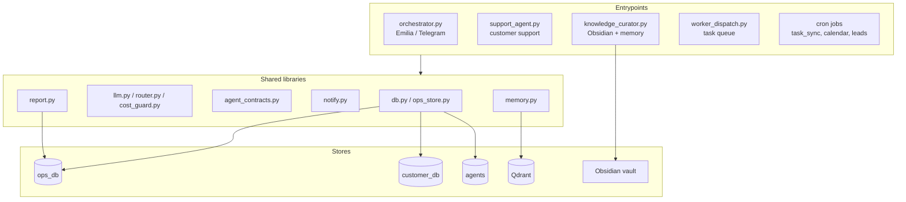
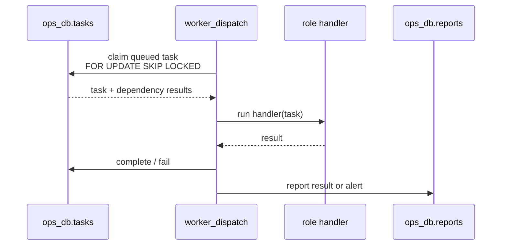

# agents/

Python runtime for the personal Amori AI team.

This folder contains long-running Telegram agents, scheduled automation,
queue workers, shared safety contracts, database helpers, audit tools, and the
test suite that protects the system from regressions.

Verified: **2026-08-14** · tests: **182 passed**.

---

## Runtime Shape



---

## Shared Libraries

| File | Responsibility |
|---|---|
| `db.py` | PostgreSQL connection helper for `agents`, `ops_db`, `customer_db`; env-only password; connect/query timeouts |
| `ops_store.py` | Schema/init and operational writes for `ops_db`: usage, runs, heartbeats, projects, tasks, reports |
| `llm.py` | Local Ollama wrapper, subscription-router bridge, optional API fallback, JSON parser, output cleanup |
| `router.py` | Local-first per-agent model routing with explicit opt-in for token APIs |
| `cost_guard.py` | LLM usage accounting and paid API budget downgrade |
| `agent_contracts.py` | Shared deterministic output contracts: product claims, external action phrases, env checks |
| `notify.py` | Telegram notifications with chunking and retries |
| `retry.py` | `net_retry` and `safe` wrappers |
| `memory.py` | Qdrant + Postgres memory; sentence-transformer is opt-in, hash vector fallback keeps agents alive |
| `base_agent.py` | Queue-worker execution scaffold |
| `worker_handlers.py` | Role-specific handlers for content/research/dev/ops workers |
| `audit_agents.py` | Per-agent operational audit from logs, usage, tasks, reports, heartbeats |
| `audit_agent_outputs.py` | Recent report audit for risky claims and fake external actions |

---

## Model Routing

Routine agents use a small private model. Complex user and queue requests go through
`amori-ai`, which classifies locally before choosing a subscription CLI:

```python
ROUTING = {
    "chief_of_staff":     "ollama/qwen3:1.7b",
    "email_watchdog":     "ollama/qwen3:1.7b",
    "knowledge_curator":  "ollama/qwen3:1.7b",
    "context_translator": "ollama/qwen3:1.7b",
    "task_sync":          "ollama/qwen3:1.7b",
    "research_agent":     "ollama/qwen3:1.7b",
    "code_agent":         "ollama/qwen3:1.7b",
    "content_agent":      "ollama/qwen3:1.7b",
    "analyst_agent":      "ollama/qwen3:1.7b",
}
```

Rules:

- UI overrides live in `ops_db.agent_config` and are cached for 30 seconds.
- If Ollama is unavailable, agents fail softly; they do not spend API tokens silently.
- `ALLOW_EXTERNAL_LLM_FALLBACK=1` is required before Gemini/Groq/OpenModel can be fallback providers.
- `amori-ai` sends code and concrete technical execution to Codex, and architecture/deep analysis to Claude.
- Subscription handoffs are capped at 16,000 characters and include no stored prompt text in metrics.
- Vision uses local `qwen3-vl:2b` first.
- Qwen/GLM/Kimi browser proxies are optional and excluded until a real smoke-test passes.
- Deprecated Groq `llama-3.3-70b-versatile` is normalized away.
- Paid model usage is guarded by `cost_guard.py`.

---

## Data Boundaries

| DB / store | Used by | Data |
|---|---|---|
| `ops_db` | most agents | projects, tasks, reports, content, audit, usage, heartbeats |
| `customer_db` | `lead_manager`, `email_agent`, `support_agent` | leads, support tickets, customer messages |
| `agents` | personal agents | team members, chief digests, known entities |
| Qdrant | memory agents | shared/project vector memory |
| Obsidian vault | `knowledge_curator` | owner notes and task translations |

Customer data does not belong in `ops_db` except derived operational metadata.

---

## Long-Running And Scheduled Agents

| Agent | File | Runtime | Purpose |
|---|---|---|---|
| `orchestrator` | `orchestrator.py` | launchd 24/7 | Main Telegram assistant, tools, voice/photo/document analysis |
| `support_agent` | `support_agent.py` | launchd 24/7 | Customer support bot, ticketing, escalation |
| `knowledge_curator` | `knowledge_curator.py` | launchd 24/7 | Obsidian capture, memory, task translation |
| `worker_dispatch` | `worker_dispatch.py` | launchd 24/7 | Drains `ops_db.tasks` for enabled workers |
| `chief_of_staff` | `chief_of_staff.py` | schedule | Telegram digest and waiting-reply analysis |
| `email_watchdog` | `email_watchdog.py` | schedule | IMAP digest |
| `calendar_agent` | `calendar_agent.py` | cron | Calendar sync; fails closed if Google OAuth is invalid |
| `task_sync` | `task_sync.py` | cron | WEEEK/Taiga task KPI report |
| `lead_manager` | `lead_manager.py` | cron/on-demand | CRM, follow-ups, lead report |
| `email_agent` | `email_agent.py` | on-demand | Outbound emails to leads |
| `infra_monitor` | `infra_monitor.py` | schedule | System health checks and alerting |
| `provider_health` | `provider_health.py` | schedule/on-demand | LLM provider checks |

### Hypothesis Hub bridge

Emilia can analyse the live portfolio of product hypotheses through `/hypotheses` or a normal message mentioning RICE, prioritisation or experiments. The bridge in `hypothesis_hub.py` reads the Hub API only; it never writes hypotheses or changes statuses. Set `HYPOTHESIS_HUB_API_URL` and, for a production Hub, the matching `HYPOTHESIS_HUB_TOKEN` in `agents/.env`.

---

## Queue Workers

`worker_dispatch.py` reads enabled workers from `ops_db.agent_registry`.

Specialized handlers:

| Worker | Handler | Contract |
|---|---|---|
| `content_writer` | `worker_handlers.content_writer` | Publish-ready copy, no unsupported Amori product claims |
| `content_designer` | `content_designer` | Visual brief and image prompt, no fake UI/product features |
| `content_reviewer` | `content_reviewer` | Verdict, issues, improved version, claims check |
| `web_researcher` | `web_researcher` | Structured research brief; current data must be verified externally |
| `dev_worker` | `dev_worker` | Proposed code/tests only; must not claim implementation without tool result |
| `lead_manager` | `ops_worker` | Operational plan/result; must not claim external action without integration result |



---

## Content Factory Semantics

`content_factory.py` is a human-in-the-loop pipeline:

```text
brief
  -> content_writer
  -> content_designer
  -> content_reviewer
  -> content_items(status='pending')
  -> owner approval
  -> Telegram publish if configured
```

Status meanings:

| Status | Meaning |
|---|---|
| `pending` | AI generated content is waiting for review |
| `approved` | Human approved, but no real external delivery has happened |
| `ready` | Channel is not configured; content is ready for manual publishing |
| `published` | Telegram API accepted the send |
| `rejected` | Human rejected |

Missing `TELEGRAM_CHANNEL_ID` moves content to `ready`, not `published`.
Delivery failure leaves content `approved` for retry.

---

## Safety Contracts

The system does not rely on prompt wording alone.

| Guard | File | Prevents |
|---|---|---|
| Product claim detection | `llm.py`, `agent_contracts.py` | real-time GPS, exact location/accuracy, geofences, health/activity monitoring, ready app, guarantees |
| External action detection | `agent_contracts.py` | fake "published/sent/implemented/tested" claims |
| Safe content fallback | `worker_handlers.py`, `email_agent.py`, `support_agent.py` | unsafe marketing copy reaching users |
| Obsidian path safety | `knowledge_curator.py` | writes outside vault |
| Calendar fail-closed | `calendar_agent.py` | adding guessed events or crashing on invalid OAuth |
| WEEEK fail-soft | `lead_manager.py` | external CRM failure breaking local lead storage |

---

## Tests And Audits

```bash
cd ~/ai-infra/agents
/opt/anaconda3/bin/python3 -m pytest tests -q
/opt/anaconda3/bin/python3 audit_agents.py
/opt/anaconda3/bin/python3 audit_agent_outputs.py --limit 80
```

Coverage includes:

- shared libs: JSON parsing, token estimates, cost guard, DB round-trips;
- agent smoke imports and regression guards;
- no hardcoded PG password / no Langfuse constructor regressions;
- customer agents use `customer_db`;
- unsupported product claims are detected;
- content factory does not fake publication;
- email fallback rewrites unsafe copy;
- Obsidian writes stay inside the vault.

---

## Current Known Operator Issues

| Issue | Impact | Fix |
|---|---|---|
| Google Calendar `invalid_grant` | Calendar sync cannot write events | Run `python3 scripts/reauthorize_calendar.py` and confirm access in Google |
| One IMAP `AUTHENTICATIONFAILED` | One mailbox missing from digest | Generate new app password |
| Historical reports before hardening | Kept for audit, hidden from current results | No action; the dashboard shows only trusted new reports |
| Telegram VPN/TLS blips | A single probe can fail transiently | Polling recovers and monitoring retries before alerting |
