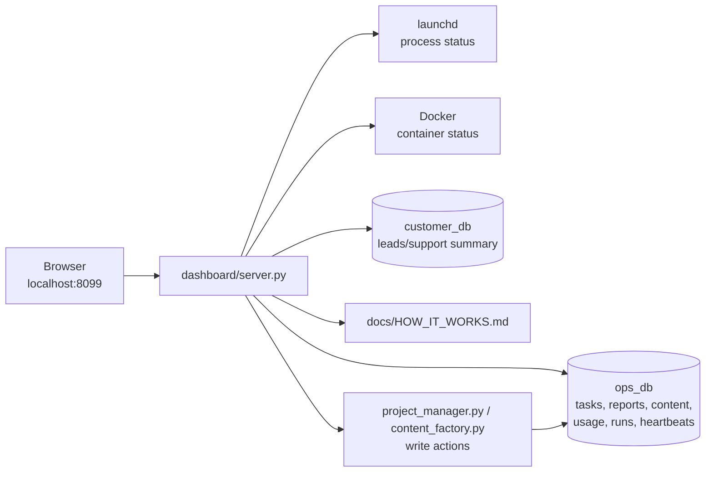
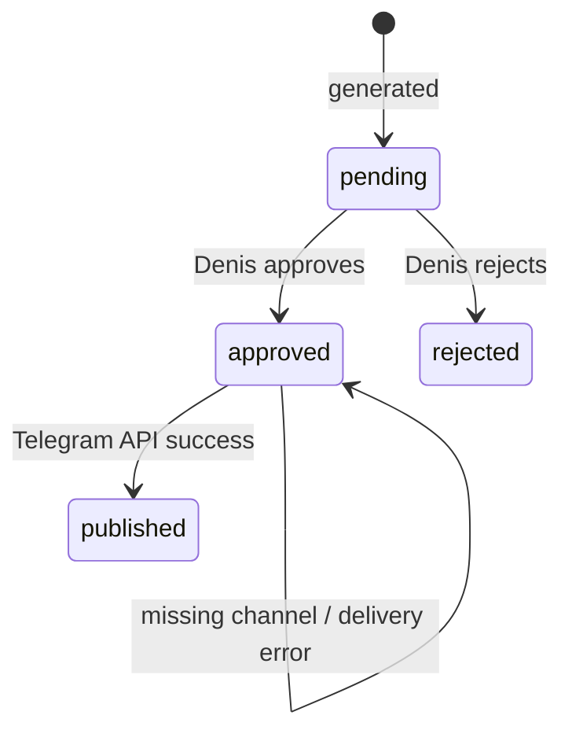

# dashboard/

Local control panel for the personal Amori AI infrastructure.

The dashboard is intentionally simple: one Python HTTP server, PostgreSQL
connection pools, static HTML/CSS/JS, and no frontend build step. It is an
operator console for Denis, not a public SaaS UI.

Verified: **2026-07-09**.

---

## What It Shows

`http://localhost:8099`

| Section | Real data source | Purpose |
|---|---|---|
| Agents | launchd, cron metadata, `ops_db.llm_usage` | Status, PID, schedule, model, last calls |
| Content factory | `ops_db.content_items` | Pending/approved/published/rejected drafts |
| Task board | `ops_db.tasks` | Queued, running, failed, done work |
| Reports feed | `ops_db.reports` | Recent agent outputs and alerts |
| Team | Static hierarchy + registry data | Who does what in the AI team |
| Infrastructure | Docker, DB queries, `infra_runs`, `infra_heartbeats` | Containers, backups, restore tests, spend |
| Docs | `docs/HOW_IT_WORKS.md` | Russian operator explanation rendered in browser |

Secondary views:

- `http://localhost:8099/office` — ambient operational office view.
- `http://localhost:8099/docs` — rendered operator documentation.
- `http://localhost:5070` — separate pixel office visualization.

---

## Data Flow



Read-heavy requests go directly through PostgreSQL pools. Write actions call
the existing agent CLIs so the dashboard does not duplicate project/content
business logic.

---

## Current Runtime Facts

The control panel currently knows about these dashboard-visible agents:

| Agent | Type | Contour | How status is determined |
|---|---|---|---|
| `orchestrator` | longrun | personal | launchd label `ai.orchestrator` |
| `support_agent` | longrun | customer | launchd label `amori.support` |
| `knowledge_curator` | longrun | personal | launchd label `knowledge.curator` |
| `chief_of_staff` | scheduled | personal | launchd label `chief.of.staff` |
| `email_watchdog` | scheduled | personal | launchd label `email.watchdog` |
| `task_sync` | cron | personal | cron metadata |
| `calendar_agent` | cron | personal | cron metadata |
| `lead_manager` | cron | customer | cron metadata |
| `email_agent` | on-demand | customer | registry/on-demand metadata |

The dashboard summary can show fewer "up" agents than the total if a launchd
service is loaded but currently has no PID, or if an on-demand worker has no
active process. That is expected and should be described as state, not hidden.

---

## Content Status Contract

The dashboard must not imply that approval equals publication.



| Status | Meaning |
|---|---|
| `pending` | AI draft is waiting for review |
| `approved` | Human accepted it; external delivery may still be absent |
| `published` | Telegram API accepted the send |
| `rejected` | Human rejected the draft |

The content UI should display external delivery failures as operator work, not
as silent success.

---

## Implementation Notes

Older versions called `docker exec psql` many times per `/api/state` request,
which made the page slow and fragile under simultaneous polling. The current
server uses `psycopg2.pool.ThreadedConnectionPool` directly against the host
Postgres port.

```python
_pools = {
    "ops_db": ThreadedConnectionPool(...),
    "customer_db": ThreadedConnectionPool(...),
}
```

Important behavior:

- All SQL writes use parameterized `%s` placeholders.
- `_jsonable()` converts `Decimal`, `date`, and `datetime` values for JSON.
- `/api/state` is cached briefly to reduce polling pressure.
- `POSTGRES_PASSWORD` is read from `~/ai-infra/agents/.env`; no password is
  committed to the repository.

---

## POST Endpoints

| Endpoint | Action | Safety note |
|---|---|---|
| `POST /api/project/new` | Runs `project_manager.py` | Creates queued internal tasks |
| `POST /api/content/new` | Runs `content_factory.py` | Creates `pending` content |
| `POST /api/content/approve` | Runs content approval/publish path | `published` only after real send |
| `POST /api/content/reject` | Rejects content | Keeps audit trail |
| `POST /api/agent/model` | Saves `ops_db.agent_config` override | Model choices are allowlisted in UI |
| `POST /api/budget` | Updates monthly paid-API cap | Used by cost guard |

---

## Launchd

```xml
<!-- ~/Library/LaunchAgents/ai.dashboard.plist -->
<key>KeepAlive</key><true/>
<key>ProgramArguments</key>
<array>
  <string>/opt/anaconda3/bin/python3</string>
  <string>/Users/denis/ai-infra/dashboard/server.py</string>
</array>
```

Restart:

```bash
launchctl kickstart -k gui/$(id -u)/ai.dashboard
```

Port: `8099`.
