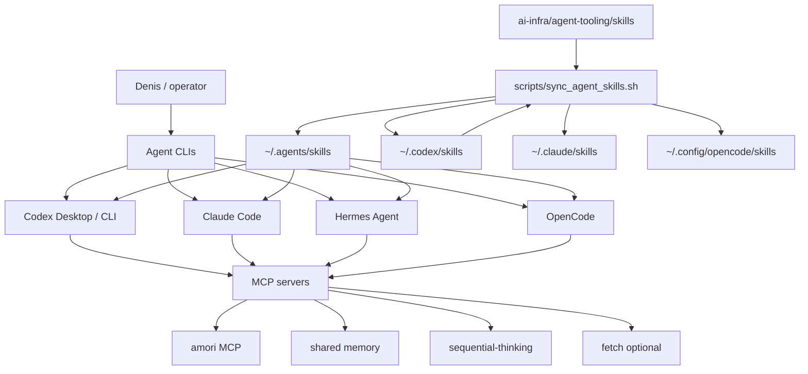

# Agent Tooling Layer - July 2026

This document describes the local agent tooling stack used on this Mac for Amori and personal
automation work. It covers Codex, Claude Code, Hermes, OpenCode, shared skills, MCP servers,
plugins, and safe update routines.

## Executive Summary

The target architecture is a shared agent-workbench, not four unrelated AI CLIs.

- Skills carry repeatable work procedures.
- MCP servers expose tools, memory, and Amori operations.
- Plugins inject reusable behavior such as Ponytail.
- Each agent keeps its native strengths, but they all see the same core operating model.
- Secrets stay outside git and outside public docs.

As of this audit:

| Tool | Local status | Update route | Role |
| --- | --- | --- | --- |
| Codex | `codex-cli 0.144.0-alpha.4` | Codex Desktop app update | Primary coding agent inside Codex Desktop |
| Claude Code | `2.1.206` | `claude update` | Strong code planning/review runner with bundled skills |
| Hermes | `0.18.2 (2026.7.7.2)` | `hermes update --backup --yes` | Self-improving personal agent with broad built-in skills |
| OpenCode | `1.17.18` | `brew install/upgrade anomalyco/tap/opencode` | Open source terminal agent, extra local fallback |

Codex `codex update` currently cannot detect the bundled Desktop install method, so update it
through the Codex desktop application when needed.

## Architecture



## Why This Shape

Use skills when the agent needs a repeatable procedure, checklist, policy, or domain workflow.
Use MCP when the agent needs live tools, data, memory, or external actions. Use plugins when the
agent runtime needs event hooks, prompt injection, slash commands, or distribution mechanics.
Use `AGENTS.md` for repository-specific rules that must always be visible.

This avoids the common failure mode where every agent learns a different version of the same
workflow.

## Shared Skills

Existing shared skills:

- `amori-content`
- `amori-ops`
- `amori-project`
- `code-review`
- `commit-pr`
- `debugging`
- `git-safe`
- `grill-me`
- `grilling`
- `mcp-tools`
- `perf`
- `refactor`
- `testing`
- `web-research`

Added in this pass:

- `agent-tooling-audit`: safe audit/update workflow for Codex, Claude Code, Hermes, OpenCode.
- `business-process-automation`: business/system analysis workflow for automation products.
- `screenshot-product-qa`: screenshot-driven UI/product QA with redaction checks.

Hermes also has its own built-in skills catalog. Keep those separate from the shared layer. The
shared layer is for Denis-specific operating procedures that should work across tools.

## MCP Matrix

| MCP | Codex | Claude Code | Hermes | OpenCode | Notes |
| --- | --- | --- | --- | --- | --- |
| `amori` | enabled | enabled | enabled | enabled | Operates local Amori AI-team |
| `memory` | enabled | enabled | enabled | enabled | Shared persistent memory file |
| `sequential-thinking` | enabled | enabled | enabled | enabled | Use only for hard planning/debugging |
| `node_repl` | enabled | no | no | no | Codex Desktop runtime tool |
| `github` | plugin/app | enabled | no | no | Keep out of OpenCode by default to reduce context load |
| `filesystem` | native tools | native tools | enabled | native tools | Avoid duplicate file tools where native tools exist |
| `fetch` | native/web tools | native WebFetch | enabled | configured disabled | Enable only when explicitly needed |

Keep MCP small. Large MCP tool surfaces increase prompt/context cost and make the agent less
predictable.

## OpenCode Configuration

The deployed OpenCode config lives at:

```text
~/.config/opencode/opencode.json
```

The repo template lives at:

```text
ai-infra/agent-tooling/opencode/opencode.json
```

It configures:

- Ponytail plugin via `@dietrichgebert/ponytail`;
- shared MCP servers: Amori, memory, sequential-thinking;
- optional disabled fetch MCP;
- `.env` read protection;
- approval prompts for edits and shell commands by default;
- hard deny for `rm -rf *` and `git reset --hard*`;
- watcher ignores for noisy build/log/cache directories.

OpenCode discovers skills from:

- `~/.config/opencode/skills`
- `~/.claude/skills`
- `~/.agents/skills`

The sync script populates all three relevant shared paths.

## Provider Policy

Do not commit provider secrets. Current local provider details are intentionally not documented
with keys.

Known local pattern:

- Hermes has provider chain entries for OpenModel / DeepSeek Flash style work and local gateways
  such as Qwen/GLM-Kimi.
- Codex uses ChatGPT auth from the desktop app.
- Claude Code uses its own authenticated CLI flow.
- OpenCode is installed and configured for skills/MCP/plugins, but provider auth should be done
  interactively with `/connect` or environment variables outside git.

## Operations

Run:

```bash
/Users/denis/ai-infra/scripts/agent_tooling_doctor.sh
```

This checks versions, skill counts, MCP config, Hermes update status, git state, and secret-looking
patterns in managed agent-tooling files.

Run:

```bash
/Users/denis/ai-infra/scripts/sync_agent_skills.sh
```

This syncs:

1. current Codex skills,
2. repo canonical skills under `ai-infra/agent-tooling/skills`,
3. shared `~/.agents/skills`,
4. Codex, Claude Code, and OpenCode target directories.

It does not use `--delete`; it is intentionally non-destructive.

## Update Runbook

### Codex

```bash
codex doctor
codex update
```

If `codex update` says it cannot detect the install method, update the Codex desktop app.

### Claude Code

```bash
claude update
claude --version
claude mcp list
```

Avoid relying on `claude doctor` in large MCP environments if it hangs; `claude mcp list` is a
lighter health check.

### Hermes

```bash
git -C ~/.hermes/hermes-agent status -sb
hermes update --backup --yes
hermes --version
hermes skills list
hermes mcp list
git -C ~/.hermes/hermes-agent status -sb
```

Rollback path from the latest update:

```bash
hermes import ~/.hermes/backups/pre-update-2026-07-10-134515.zip
```

Hermes also preserved the pre-update local build-script change in git stash:

```bash
git -C ~/.hermes/hermes-agent stash list
```

Do not apply that stash unless a future Hermes desktop build specifically needs it.

### OpenCode

```bash
brew upgrade anomalyco/tap/opencode
opencode --version
opencode debug config
```

If provider auth is missing, start the TUI and use `/connect`.

## Security Rules

- Never place API keys, bot tokens, session secrets, Telegram channel IDs, or private customer
  data in this repo.
- Do not publish screenshots before checking for private messages, channel IDs, tokens, local
  paths that reveal sensitive context, or unreleased commercial internals.
- Prefer shared skills over giant always-on prompt files.
- Prefer a small MCP surface over every possible integration.
- Treat community skills/plugins as code execution. Review before install.

## July 2026 Recommendations

1. Keep `~/.agents/skills` as the vendor-neutral shared skill directory.
2. Keep Codex and Claude Code skills mirrored for native discovery.
3. Let Hermes read shared skills through `skills.external_dirs` instead of copying them into the
   Hermes built-in catalog.
4. Keep OpenCode installed as a fallback/secondary terminal agent, but do not over-permission it.
5. Use Ponytail consistently for code work across agents.
6. Add new skills only for repeated workflows with real operational value.
7. Run `agent_tooling_doctor.sh` after any update.

## Open Gaps

- Add a lightweight provider health script for local Qwen/GLM-Kimi gateways.
- Add an Amori-specific "release readiness" skill once the SMM platform reaches stable v1.
- Decide whether OpenCode should get GitHub MCP after measuring context cost.
- Move any long-lived Hermes provider keys into a safer secret store if Hermes adds first-class
  support for it in a future release.
