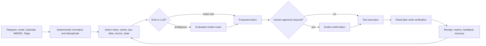

# Amori OS: план полезной автоматизации и LLM-эффективности

Дата аудита: 13 августа 2026 года.

Это не список функций ради функций. План строится вокруг одного цикла: система
обнаруживает обязательство, превращает его в понятное действие, запрашивает
подтверждение там, где оно нужно, выполняет действие инструментом и проверяет
результат.

## 1. Проверенный baseline

| Область | Факт на момент аудита |
|---|---|
| Базовые сервисы | PostgreSQL, Redis, Qdrant, Langfuse и n8n работают |
| Обязательные агенты | 8 из 8 доступны; on-demand агент не считается остановленным |
| Telegram | Emilia и Support отвечают на `getMe` |
| Рабочие интерфейсы | Dashboard, Pixel Office, SMM Factory, Langfuse, Qdrant и n8n отдают HTTP 200 |
| Задачи/очередь | Активных и failed задач на момент проверки нет |
| Backup | Свежий локальный backup присутствует, restore-test проходит |
| Календарь | Агент работает в safe mode, но Google OAuth требует личной повторной авторизации |
| Локальные модели | Windows-нода `denis-k` offline; маршрутизатор использует рабочий API fallback |
| n8n | Контейнер работает, но активных бизнес-workflow нет: `0` из `1` |
| Langfuse | Сервис работает, но production-трейсы и версии промптов пока не подключены |
| Семантическая память | Qdrant есть, но по умолчанию включён hash-vector fallback, а не semantic embedding |

### LLM baseline за 30 дней

Сохранённые данные до этого релиза были оценочными, поэтому цифры подходят для
поиска крупных потребителей, но не для точного биллинга.

| Агент | Вызовы | Токены |
|---|---:|---:|
| Chief of Staff | 50 | 82 899 |
| Task Sync | 28 | 80 886 |
| Emilia / orchestrator | 36 | 22 325 |
| Email Watchdog | 28 | 19 253 |
| Calendar Agent | 15 | 9 252 |
| Все агенты | 200 | 226 145 |

Chief of Staff и Task Sync формируют 72,4% учтённой нагрузки. Поэтому первая
оптимизация направлена именно на них.

## 2. Что уже улучшено этим релизом

1. В `llm_usage` разделены provider-токены и локальная оценка; добавлены задержка,
   cached prompt tokens и источник измерения.
2. Для Praison-агентов используются фактические счётчики провайдера, когда они
   доступны; для остальных остаётся локальный `tiktoken`, а не грубый `len/4`.
3. `make llm-report` показывает 7/30-дневную нагрузку, точность измерения, кэш и
   самых дорогих по токенам агентов без вывода текстов и персональных данных.
4. Task Sync вычисляет fingerprint значимых полей. Если задачи не изменились,
   LLM не вызывается, а Telegram получает короткое детерминированное сообщение.
5. В повторяемых промптах статические инструкции перенесены в начало, динамические
   данные в конец. Это создаёт корректную структуру для provider prompt caching.
6. Dashboard показывает токены за 7 дней, долю точных измерений и cache hit rate.
7. Удалены выключенные Groq-модели из активной конфигурации. Text/vision fallback
   переведён на `qwen/qwen3.6-27b`.
8. Добавлен `make model-eval`. Текущий canary: GPT OSS 120B прошёл 4/4, 20B только
   2/4, поэтому production routing не изменён.
9. Ответы очищаются от provider-specific `<think>`/`<final>` блоков в общей
   LLM-обёртке и повторно на Telegram-границе, чтобы внутреннее рассуждение не
   попадало пользователю или в историю диалога.
10. Письма, переписки и описания внешних задач явно помечены в промптах как
    недоверенные данные; инструкции внутри них не должны менять поведение агента.
11. Подготовлен изолированный Python runtime с проверенным lock-файлом. В нём
    `pip check`, 174 теста и `pip-audit` проходят без известных уязвимостей;
    живые процессы переключаются отдельной атомарной операцией с rollback plist.

## 3. Главные продуктовые пробелы

### P0. Единый inbox решений

Сейчас email, Telegram, календарь, задачи и лиды создают отдельные дайджесты. Это
увеличивает сообщения, но не гарантирует закрытие обязательств.

Нужно: таблица `action_items` и один экран/команда `Сегодня`, где каждый пункт имеет
источник, владельца, срок, подтверждение, внешний ID и состояние
`new -> accepted -> doing -> done/verified`.

Готово, когда: одно обязательство не дублируется между агентами; его можно закрыть,
отложить, делегировать или открыть в источнике; `done` ставится только после проверки.

### P0. Замкнутый контур календаря и встреч

Нужно: голос/текст в Emilia -> разбор даты -> подтверждение -> Google Calendar ->
чтение созданного события -> напоминание -> заметки после встречи -> задачи и follow-up.

Готово, когда: создание, перенос, удаление и недельный обзор проходят e2e; внешний
`event_id` сохранён; повторная команда идемпотентна. Блокер: обновление Google OAuth.

### P0. Продажи без ручного просмотра таблиц

Нужно: ежедневная очередь контактов из CRM/WEEEK, карточка лида с контекстом,
предложенный текст, подтверждение отправки, фиксация ответа и следующего шага.

Готово, когда: у каждого активного лида есть контакт, owner, next action и срок;
сообщение считается отправленным только по результату Telegram/email-инструмента.

### P1. Один утренний план вместо нескольких отчётов

Нужно объединить факты Chief of Staff, email, Calendar, Task Sync и Lead Manager,
детерминированно удалить дубли и ранжировать: блокеры, обещания людям, деньги,
сегодняшние сроки. LLM только сжимает и объясняет, но не придумывает факты.

Готово, когда: в 08:30 приходит один план с Top 3 и действиями; отдельные агенты
пишут только при аварии или новом срочном событии.

### P1. SMM-календарь полного цикла

Нужно: недельные темы -> пакет черновиков и изображений -> один экран проверки ->
расписание -> HITL -> публикация -> подтверждение Telegram -> метрики результата.

Готово, когда: оператор вводит недельную цель и ограничения один раз, а не повторяет
brief для каждого поста; ни один пост не получает `published` без внешнего receipt.

### P1. Реальная память и контур качества

Нужно заменить hash-vector на локальную multilingual embedding-модель, перенести
промпты в версии Langfuse и связать trace с thumbs up/down и причиной исправления.

Готово, когда: retrieval проходит набор тестов на русских фактах; для каждого
изменения промпта видны версия, качество, latency и tokens; rollback занимает минуты.

## 4. Целевая схема

## 5. Модельная стратегия

| Работа | Маршрут | Правило |
|---|---|---|
| Парсинг, дедупликация, сроки | Код/SQL | Не тратить LLM на известное правило |
| Классификация и короткий JSON | GPT OSS 20B candidate | Только после eval не хуже baseline |
| Управленческий вывод и неоднозначные решения | GPT OSS 120B | Текущий production default |
| Изображения/OCR | Qwen 3.6 27B/Gemini | По доступности и проверенному качеству |
| Приватный тяжёлый анализ | Ollama | Только когда Windows-нода online; иначе API fallback |
| Код и архитектура высокого риска | Codex/Claude Code | Ручной контур, тесты и review |
| Актуальный web/social research | Grok/xAI candidate | Подключать только с источниками и отдельным бюджетом |

### Как экономить без потери качества

1. Rules first: даты, статусы, дубли, формат и известные вычисления делает код.
2. Delta context: модели получают только изменения после последнего успешного запуска.
3. Stable prefix: системные инструкции и схемы идут до переменных данных.
4. Quality gate: дешёвая модель включается только после 20-30 обезличенных кейсов
   на агент с не меньшей корректностью JSON/фактов и нулём опасных действий.
5. Batch: несрочные массовые eval и пакеты контента можно отправлять асинхронно;
   интерактивные команды Emilia и аварии остаются synchronous.
6. Context hygiene: старые tool outputs, MCP и инструкции не должны ехать в каждый запрос.

## 6. Утилиты и решение по внедрению

| Инструмент | Решение | Почему |
|---|---|---|
| Langfuse | Внедрить следующим | Уже работает локально; даст traces, prompt versions, evals |
| LiteLLM Proxy | Пока не ставить в production | Роутер и cost guard уже есть; второй control plane сейчас добавит риск. Нужен при 3+ оплачиваемых API/клиентах, общих лимитах и ключах |
| Groq prompt caching | Использовать автоматически | Код уже перестроен под stable prefix; измерять `cached_tokens`, не обещать hit без метрик |
| Groq Batch | Пилот для eval/пакетного контента | Не подходит для Telegram, зато отделяет несрочную нагрузку и снижает API-цену |
| n8n | Использовать только как интеграционный слой | Удобен для webhook/cron/уведомлений; источником истины остаётся Postgres |
| Claude Code | Включить дисциплину `/usage`, `/context`, `/clear`, focused `/compact` | Уменьшает повторную отправку старого контекста и лишних MCP definitions |
| Codex | Узкие задачи, короткий AGENTS, skills по запросу, отдельные review/test шаги | Меньше ненужных чтений и контекста; экономию подтверждать на собственных задачах |
| Grok API | `x-grok-conv-id`, prompt cache key, context compaction | Только после подключения API и метрик стоимости/качества |

Опора на официальную документацию:

- [Groq prompt caching](https://console.groq.com/docs/prompt-caching)
- [Groq Batch](https://console.groq.com/docs/batch)
- [Groq model deprecations](https://console.groq.com/docs/deprecations)
- [Claude Code cost and context guidance](https://code.claude.com/docs/en/costs)
- [LiteLLM Proxy](https://docs.litellm.ai/)
- [Langfuse prompt management](https://langfuse.com/docs/prompt-management/overview)
- [xAI prompt caching](https://docs.x.ai/developers/advanced-api-usage/prompt-caching)
- [xAI context compaction](https://docs.x.ai/developers/advanced-api-usage/context-compaction)
- [OpenAI model guidance](https://developers.openai.com/api/docs/guides/latest-model)

## 7. Очередь реализации

### Этап A: измеримость и устранение повторов

Статус: реализован в этом релизе.

Приёмка: `make llm-report`; новые provider-вызовы помечаются как точные; повторный
Task Sync без изменений не вызывает LLM; dashboard отображает метрики.

### Этап B: Action Inbox и единый утренний план

Срок: 1-2 недели. Добавить схему, ingestion adapters, дедупликацию, lifecycle,
Telegram-кнопки и dashboard. Перевести существующие дайджесты в producers фактов.

Приёмка: 10 тестовых обязательств из разных источников дают 10, а не 15-20 пунктов;
каждое действие отслеживается до verified; недельный dry run не теряет сроки.

### Этап C: календарь и lead follow-up end-to-end

Срок: 1 неделя после Action Inbox. Сначала обновить Google OAuth, затем добавить
read-after-write и внешние IDs. Для лидов использовать approve-before-send.

Приёмка: create/update/delete/list Calendar и CRM follow-up проходят сценарные тесты;
ошибка внешнего API не создаёт ложный `done`.

### Этап D: model eval и routing

Срок: 3-5 дней. Собрать по 20-30 обезличенных примеров для Chief, Task Sync,
Email, Calendar и Emilia. Сравнить 20B/120B/Gemini по фактам, JSON, latency, tokens.

Приёмка: 20B получает отдельный маршрут только при качестве не ниже baseline и
нуле critical failures; 120B остаётся автоматическим fallback.

### Этап E: Langfuse и semantic memory

Срок: 1 неделя. Подключить traces без prompt/customer payload по умолчанию,
versioned prompts и eval labels. Выбрать multilingual embeddings и переиндексировать
отдельную коллекцию, не перезаписывая старую до A/B retrieval test.

Приёмка: trace coverage >=95%; prompt rollback проверен; retrieval@5 на контрольном
наборе >=90%; секреты и личные тексты не попадают в экспорт support bundle.

## 8. Метрики результата

- не менее 50% запусков Task Sync без изменений обходятся без LLM;
- 100% новых LLM-записей имеют явный источник измерения;
- один утренний actionable digest вместо повторяющихся сводок;
- не менее 95% внешних действий имеют receipt/read-after-write;
- просроченное обязательство нельзя потерять молча;
- смена модели происходит только через eval и rollbackable config;
- false `published`, `sent`, `done` остаются равны нулю.

## 9. Что требует личного действия Дениса

1. Пройти Google OAuth через `scripts/reauthorize_calendar.py`, иначе календарные
   записи останутся в safe mode.
2. Решить, должна ли Windows-нода работать постоянно. Если да, настроить автозапуск
   Tailscale и Ollama; если нет, считать её opportunistic и не строить SLA вокруг неё.
3. Для model eval оценить 20-30 обезличенных ответов каждого важного агента. Только
   владелец может определить, полезен ли управленческий вывод, а не просто валиден JSON.
