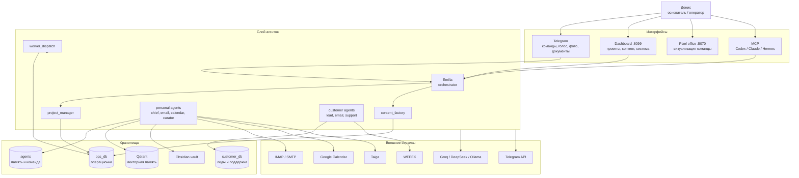
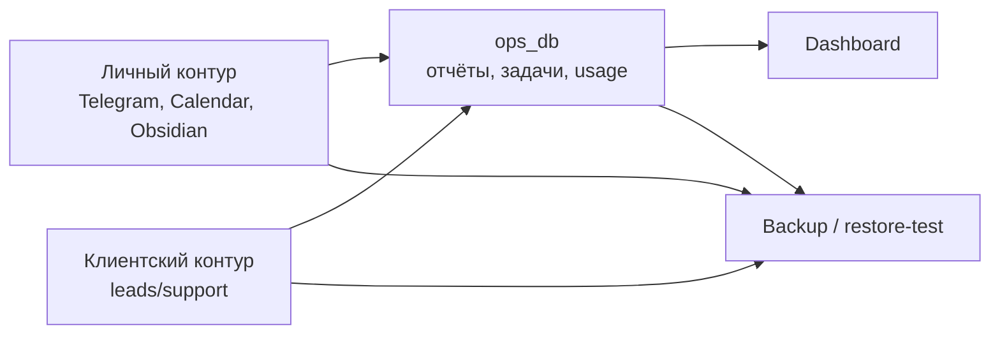
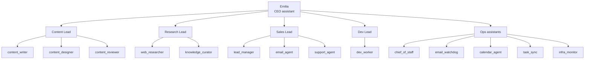
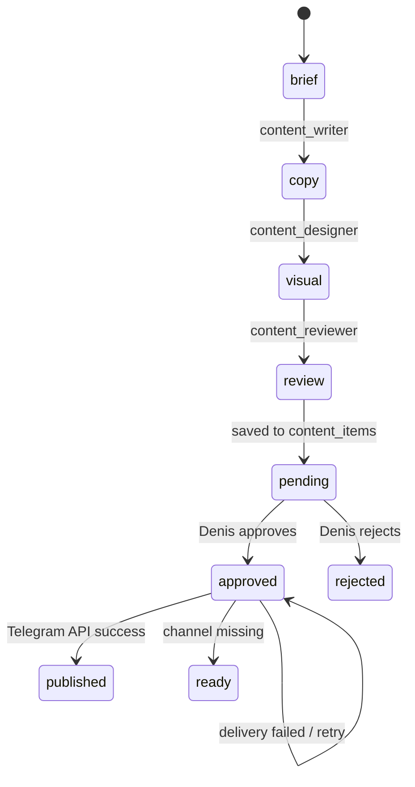

# Amori AI-инфра — как всё работает

> Личная AI-команда Дениса Колесникова для операционной работы над Amori.
> Обновлено: 2026-08-12. Полная проверенная фиксация:
> [`SYSTEM_BASELINE_2026-08-12.md`](SYSTEM_BASELINE_2026-08-12.md).

---

## 1. Смысл системы

Amori AI-инфра — это локальная операционная система из агентов, баз данных,
дашборда, очереди задач, бэкапов и аудита. Она помогает одному founder/operator
вести несколько рабочих контуров:

- личные задачи и коммуникации;
- SMM и контент для Amori;
- CRM/лиды/поддержку;
- аналитику задач и статуса команды;
- знаниевую базу;
- мониторинг и восстановимость инфраструктуры.

Это не автономный бот, который сам публикует всё подряд. Система работает по
правилу:

> AI готовит, проверяет, раскладывает и предлагает. Денис подтверждает внешние
> и необратимые действия.

---

## 2. Текущее состояние

Факты последней проверки:

| Параметр | Значение |
|---|---|
| Контейнеры | 5/5 работают |
| Dashboard | `http://localhost:8099` |
| Pixel office | `http://localhost:5070` |
| Тесты агентов | `158 passed` |
| Очередь задач | пустая на момент проверки |
| Основная Groq-модель | `groq/openai/gpt-oss-120b` |
| Платный API | лимит 2500 RUB/мес, текущий paid spend 0.00 RUB |
| Restore-test | проходит, бэкап восстановим |

Зоны внимания:

- `calendar_agent`: Google OAuth token протух (`invalid_grant`), нужна повторная авторизация.
- DeepSeek/OpenModel отключён после HTTP 402; рабочая цепочка — Gemini → Groq.
- После безопасной очистки Docker-образов свободно около 22 ГБ; doctor предупреждает
  при снижении запаса ниже 15 ГБ.
- В БД есть старые отчёты от июня с неподтверждёнными продуктовым claims; новые guardrails уже
  блокируют такие ответы.
- Telegram polling автоматически восстанавливается после `EndOfStream`/SSL ошибок, а monitor
  предупреждает только после трёх последовательных transient-сбоев.

---

## 3. Архитектура



---

## 4. Данные

### Базы PostgreSQL

| База | Зачем нужна | Примеры таблиц |
|---|---|---|
| `ops_db` | Операционное ядро и аудит | `projects`, `tasks`, `reports`, `content_items`, `agent_registry`, `llm_usage`, `infra_runs`, `infra_heartbeats` |
| `customer_db` | Клиентский контур | `leads`, `support_tickets`, `support_messages`, `support_faq` |
| `agents` | Личная память и команда | `team_members`, `known_entities`, `chief_digests` |
| `n8n` | workflow state | внутренние таблицы n8n |

### Неформальные и внешние данные

| Источник | Как используется |
|---|---|
| Telegram личный контур | Команды, диалог с Emilia, дайджесты Chief of Staff |
| Telegram support bot | Клиентские тикеты и эскалации |
| Obsidian vault | Сохранённые заметки, задачи, контекст команды |
| Qdrant | Векторный поиск по shared/project memory |
| IMAP | Входящая почта для daily digest |
| SMTP | Outbound email для лидов, только по явной команде |
| Google Calendar | Календарные события, когда OAuth token валиден |
| WEEEK/Taiga | Снимки задач, KPI, управленческий отчёт |



Секреты не документируются и не коммитятся. В README допустимы только имена
переменных окружения, но не значения.

---

## 5. Агенты и роли

| Агент | Тип | Что делает | Статус/особенности |
|---|---|---|---|
| `orchestrator` / Emilia | 24/7 | Главный Telegram-ассистент, роутинг инструментов, ответы, файлы, фото, голос | Работает |
| `chief_of_staff` | расписание | Утренний/вечерний дайджест переписок | Работает |
| `email_watchdog` | расписание | Смотрит почту и выделяет важное | Один IMAP аккаунт требует новый пароль |
| `calendar_agent` | cron | Ищет встречи, безопасно синхронизирует календарь | Нужен новый Google OAuth token |
| `knowledge_curator` | 24/7 | Сохраняет заметки в Obsidian, переводит задачи для команды | Path guard включён |
| `task_sync` | cron | WEEEK/Taiga KPI и управленческий отчёт | Иногда ловит внешние timeouts |
| `lead_manager` | cron/on-demand | Лиды, follow-up, CRM-отчёт | WEEEK fail-soft |
| `email_agent` | on-demand | Письма лидам | Проверяет SMTP env и claims |
| `support_agent` | 24/7 | Поддержка клиентов, тикеты, эскалации | Клиентский контур |
| `content_factory` | on-demand | Бриф -> текст -> визуал -> ревью -> аппрув | Не маркирует как published без реальной отправки |
| `worker_dispatch` | 24/7 | Забирает задачи из очереди и запускает воркеров | Heartbeat ok |
| `infra_monitor` | расписание | Проверяет контейнеры, launchd, бэкапы, диск, логи | Пишет heartbeat |

### Иерархия AI-команды



---

## 6. Контент-завод

Пайплайн:



Важное правило: `published` означает только реальную успешную отправку внешним
инструментом. Если Telegram-канал не настроен, материал переходит в `ready`,
то есть готов к ручной публикации. Если отправка упала, материал остаётся
`approved`, чтобы его можно было повторить.

---

## 7. Контракты качества

Система содержит детерминированные проверки, а не только промпты.

| Проверка | Что предотвращает |
|---|---|
| Product claims guard | Не даёт обещать real-time GPS, точность, здоровье/активность, геозоны, готовое приложение, гарантию |
| External action guard | Ловит “опубликовано/отправлено/внедрено” без результата инструмента |
| HITL | Публикации и исходящие действия требуют подтверждения |
| Calendar safe mode | Без точной даты/времени/причины событие не добавляется автоматически |
| Obsidian path guard | LLM не может записать файл вне vault |
| CRM fail-soft | Лид сохраняется локально даже при падении WEEEK |
| Restore-test | Бэкап считается полезным только если восстановился |

Проверки:

```bash
cd ~/ai-infra/agents
/opt/anaconda3/bin/python3 -m pytest tests -q
/opt/anaconda3/bin/python3 audit_agents.py
/opt/anaconda3/bin/python3 audit_agent_outputs.py --limit 80
```

---

## 8. Где смотреть

| Место | Что смотреть |
|---|---|
| `http://localhost:8099` | Главный dashboard: проекты, отчёты, content factory, система |
| `http://localhost:8099/docs` | Этот документ |
| `http://localhost:5070` | Pixel office |
| `~/ai-infra/agents/*.log` | Логи агентов |
| `~/ai-infra/backups/restore_test.log` | Проверка восстановления |
| `ops_db.infra_heartbeats` | Пульс компонентов |
| `ops_db.infra_runs` | История monitor/backup/restore/test |

---

## 9. Быстрые команды

```bash
# Статус dashboard API
curl -s http://localhost:8099/api/state

# Тесты
cd ~/ai-infra/agents
/opt/anaconda3/bin/python3 -m pytest tests -q

# Аудит агентов
/opt/anaconda3/bin/python3 audit_agents.py

# Restore-test
cd ~/ai-infra/backups && ./restore_test.sh

# Перезапуск долгоживущих сервисов
launchctl kickstart -k gui/$(id -u)/ai.orchestrator
launchctl kickstart -k gui/$(id -u)/ai.worker
launchctl kickstart -k gui/$(id -u)/ai.dashboard
launchctl kickstart -k gui/$(id -u)/knowledge.curator
launchctl kickstart -k gui/$(id -u)/amori.support
```

---

## 10. Что улучшить дальше

| Приоритет | Действие | Польза |
|---|---|---|
| P0 | Обновить Google Calendar OAuth token | Вернуть безопасную календарную автоматизацию |
| P0 | Обновить app-password проблемного email-ящика | Вернуть полный email digest |
| P1 | Очистить/пометить старые плохие reports | Сделать аудит чище |
| P1 | Добавить ротацию больших Telegram traceback logs | Снизить шум логов |
| P1 | Подключить реальную генерацию изображений | Превратить visual briefs в готовые ассеты |
| P2 | Подключить search API для web_researcher | Сделать ресёрч актуальным |
| P2 | Подключить supervised code-apply для dev_worker | Перевести dev-агента из “советника” в “исполнителя под контролем” |
| P2 | Вынести секреты в secret backend | Уменьшить риск локальных env-файлов |

---

## 11. Главное правило эксплуатации

Если агент говорит, что что-то сделал, это должно подтверждаться либо записью в
БД, либо результатом внешнего инструмента, либо логом. Всё остальное считается
черновиком, рекомендацией или планом.
