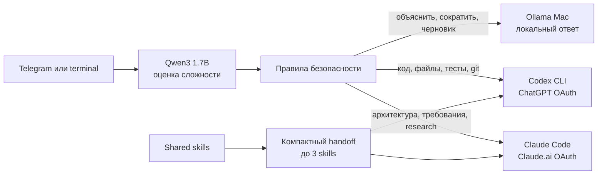

# Умная маршрутизация моделей Amori

Дата проверки: 14 августа 2026 года.

## Цель

Один вход для Дениса и агентов должен давать быстрый ответ на простой вопрос,
но подключать сильный coding/analysis backend, когда задача действительно сложная.
Система не использует отдельную API-оплату без явного разрешения.



## Реализованный контур

| Слой | Реализация | Оплата | Назначение |
|---|---|---|---|
| Router | `qwen3:1.7b` в Ollama | нет | JSON-классификация + детерминированные guardrails |
| Fast answer | `qwen3:1.7b` | нет | короткие вопросы, summary, rewrite, простой контент |
| Vision | `qwen3-vl:2b` | нет | фото и скриншоты в Emilia |
| Hermes | `amori-hermes:4b` | нет | локальный Hermes-профиль и инструменты |
| Code/execution | Codex CLI | существующая ChatGPT subscription | репозитории, команды, тесты, browser QA, git |
| Architecture/research | Claude Code | существующая Claude subscription | требования, сравнение вариантов, глубокий review |

Подписки имеют собственные usage limits. Роутер не превращает их в API-ключи и не
гарантирует безлимитную работу; он лишь исключает отдельный per-token API bill.

## Почему простой чат не запускает полный Hermes

Hermes подключён к локальному endpoint и модели `amori-hermes:4b`, paid fallback
отключён. Полный Hermes загружает большой system/tool prompt, поэтому на этом Mac
он заметно медленнее прямого Ollama-вызова. Команда `amori-ai` использует тот же
локальный контур напрямую для быстрых ответов, а Hermes остаётся доступен для
ручных tool-сессий. Это функциональное разделение, а не незавершённая интеграция.

## Правила выбора

| Запрос | Маршрут |
|---|---|
| «Что такое RAG?» | local |
| «Сократи этот текст» | local |
| «Подготовь короткий пост» | local |
| «Исправь Python API и прогони тесты» | Codex |
| «Измени событие календаря» | Codex execution backend + инструмент агента |
| «Спроектируй архитектуру и сравни риски» | Claude |
| «Найди актуальные данные за сегодня» | Claude/web-capable backend |

Сильные сигналы кода и действий перекрывают ошибку маленького классификатора.
Локальный lane read-only. Любое изменение через terminal требует `--act`; queue
workers формируют ответ/предложение и не получают автоматическое право менять файлы.

## Экономия контекста

1. В routing-модель отправляется не более 12 000 символов запроса.
2. В subscription handoff передаётся не более 16 000 символов: начало задачи и
   последние факты сохраняются, середина явно помечается как сокращённая.
3. Выбирается максимум три релевантных skills. Передаются имя, описание и путь,
   а полный `SKILL.md` читает только выбранный backend.
4. Метрики сохраняют маршрут, длительность и skill names, но не текст запроса.
5. Неизменившиеся фоновые данные должны обрабатываться правилами/fingerprint без LLM.
6. Внешние token APIs заблокированы, пока оператор явно не установит
   `ALLOW_EXTERNAL_LLM_FALLBACK=1`.

## Входы

```bash
# интерактивный чат
amori-ai

# один вопрос с автоматическим выбором
amori-ai "Объясни RAG простыми словами"

# посмотреть решение без вызова backend
amori-ai --route-only --explain "Исправь API и добавь тесты"

# разрешить Codex изменить текущий проект
amori-ai --act --cwd ~/project "Исправь баг, проверь тестами"

# ручной выбор
amori-ai --to codex --cwd ~/project "Проведи code review"
amori-ai --to claude --cwd ~/project "Сравни варианты архитектуры"
```

Emilia вызывает тот же bridge в `agents/llm.py`. Универсальный worker, `dev_worker`
и `web_researcher` сначала используют `amori-ai`; если команда недоступна, они
fail-soft возвращаются к локальному агенту.

## Проверка после перезагрузки

```bash
brew services list | grep ollama
curl --max-time 5 http://127.0.0.1:11434/api/tags
ollama list
amori-ai --doctor
codex login status
claude auth status
```

`amori-ai --doctor --live-check` делает реальные subscription-вызовы и расходует
allowance, поэтому его запускают только после логина/обновления или при подозрении
на отозванный OAuth.

## Проверенные сценарии 14.08.2026

| Проверка | Результат |
|---|---|
| Local text | ответ за 1,44 с |
| Local vision | корректное описание тестового терминала за 19,09 с |
| Simple routing | `hermes`, complexity `simple` |
| Code routing | `codex`, skills `debugging`, `testing` |
| Architecture routing | `claude`, complexity `complex` |
| Codex auth | ChatGPT login обнаружен, реальный CLI-вызов проходит |
| Claude status | Claude.ai Pro login обнаружен; live token требует повторного входа |
| Router unit tests | 22 passed |
| Agent routing/contract tests | 74 passed |
| Full agent suite | 182 passed |

## Известные ограничения

- На Data volume осталось меньше 10 ГБ. До очистки нельзя устанавливать новые
  крупные модели или Docker-образы; рабочий запас должен быть минимум 15-20 ГБ.
- Claude CLI показывает активную Pro-сессию, но реальный запрос ранее получил
  revoked OAuth. Нужен `claude auth login`; автоматический маршрут пока завершает
  такие задачи через Codex.
- Локальная модель экономична и приватна, но не заменяет web research и глубокий
  архитектурный review. Quality eval нужно расширять на реальные обезличенные кейсы.
- Hermes upstream doctor сообщает high advisories в build tooling web/TUI; основной
  Python/runtime-контур чист, но upstream нужно обновлять по мере релизов.
- `pip-audit` ошибочно предлагает для `praisonaiagents` 1.x исправление версии
  `4.5.128` из другой линии PraisonAI. Release gate не игнорирует риск вслепую:
  `scripts/verify_praison_approval.py` проверяет, что approval cache реально зависит
  от аргументов вызова и имени агента, после чего точечно исключает `PYSEC-2026-2946`.

## Следующий измеримый этап

Собрать 30-50 обезличенных реальных запросов с ожидаемым маршрутом и оценкой ответа.
Считать route accuracy, latency, subscription escalation rate и повторные запросы.
Менять policy/model только после сравнения с baseline; целевые показатели:

- не менее 90% правильных маршрутов;
- не менее 70% бытовых запросов остаются локально;
- 100% code mutations требуют `--act` или HITL;
- 0 текстов запросов и секретов в routing metrics;
- не более одного subscription backend на обычный запрос, кроме документированного fallback.
