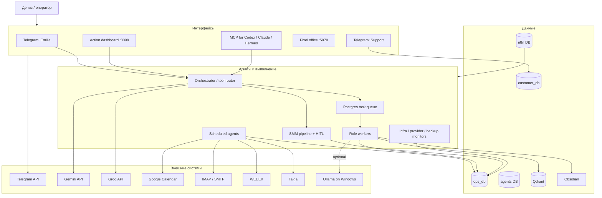
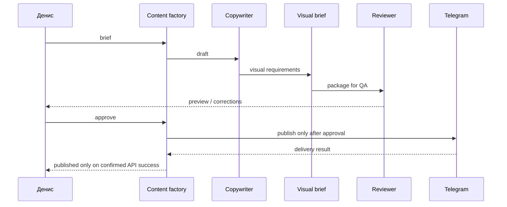

# Amori Agent OS: зафиксированное состояние на 12.08.2026

Этот документ описывает фактически работающую локальную систему на Mac mini. Это
не список будущих функций и не маркетинговое обещание. При расхождении со старыми
заметками приоритет у этого baseline и результатов `make release-check`.

## 1. Назначение

Amori Agent OS помогает Денису Колесникову вести операционную работу Amori:

- принимать запросы текстом, голосом, изображением и документом через Emilia;
- готовить управленческие, почтовые, CRM- и инфраструктурные дайджесты;
- хранить задачи, отчёты, лидов и память в разделённых контурах;
- готовить SMM-материалы с обязательным подтверждением перед публикацией;
- выполнять фоновые задачи очереди и оставлять проверяемый журнал;
- восстанавливаться после перезагрузки Mac и проверять резервные копии.

Система не заменяет человека в необратимых действиях. Публикация, отправка клиенту
и изменение внешних данных требуют явного сценария и, где предусмотрено, HITL.

## 2. Проверенный статус

Проверено локально 12.08.2026 после пересоздания core Compose и рестарта агентов.

| Контур | Фактическое состояние |
|---|---|
| Core Docker | 5/5: PostgreSQL, Redis, Qdrant, Langfuse, n8n |
| Постоянные процессы | Emilia, worker, support, curator, dashboard, pixel office |
| Telegram | `getMe` проходит для Emilia и Support; команды опубликованы |
| Dashboard | `127.0.0.1:8099`, удалённый API требует bearer token |
| Pixel office | `127.0.0.1:5070` локально, доступ через настроенный private network |
| LLM production chain | Gemini 3.6 Flash, затем Groq GPT OSS 120B |
| DeepSeek/OpenModel | отключён до появления кредита; HTTP 402 больше не тормозит задачи |
| Ollama GPU node | опциональный; при выключенном Windows ПК роутер уходит на Groq |
| Qwen/GLM/Kimi web proxies | отключены как optional: реальные smoke-тесты не прошли |
| Agent tests | полный набор проходит; точное число показывает `make test` |
| Output audit | текущие доверенные отчёты без известных риск-паттернов |
| Backup | свежий локальный и off-site снимок, SHA-256 checksums |
| Restore | свежий backup восстановлен в одноразовый PostgreSQL: PASS |

## 3. Архитектура



## 4. Рабочие сценарии

### Emilia

- отвечает на обычный текст;
- распознаёт голос и передаёт транскрипт в тот же контур намерения;
- анализирует изображения через Groq Vision с Gemini fallback;
- извлекает текст из поддерживаемых документов;
- создаёт и изменяет календарные действия через подтверждение;
- сохраняет заметки и передаёт многошаговые цели в очередь команды;
- не показывает служебный Markdown со звёздочками в Telegram-ответах.

Команды Telegram: `/start`, `/help`, `/save`, `/translate`, `/team`.

### Support

- отвечает на FAQ и клиентские вопросы;
- создаёт обращение в customer contour;
- эскалирует вопрос, когда уверенного ответа нет;
- не имеет доступа к личной памяти основателя.

Команды Telegram: `/start`, `/help`, `/status`, `/contact`.

### Операционные агенты

| Компонент | Режим | Результат |
|---|---|---|
| `chief_of_staff` | расписание | краткий Telegram-дайджест диалогов и обязательств |
| `email_watchdog` | расписание | письма, требующие ответа, без сырой Markdown-вёрстки |
| `calendar_agent` | расписание/HITL | недельные события и безопасные изменения Calendar |
| `task_sync` | расписание | WEEEK/Taiga KPI и управленческие риски |
| `lead_manager` | расписание/on-demand | лиды, контакты, follow-up, WEEEK fail-soft |
| `knowledge_curator` | 24/7 | Obsidian, перевод задач, память |
| `worker_dispatch` | 24/7 | атомарный claim задач и запуск role workers |
| `infra_monitor` | расписание | только устойчивые проблемы, без алерта на один TLS timeout |

### SMM и контент



## 5. Данные и границы

| Хранилище | Данные | Правило |
|---|---|---|
| `ops_db` | проекты, задачи, отчёты, контент, heartbeats, LLM usage | операционный журнал |
| `customer_db` | лиды, контакты, support tickets/messages | отдельно от личной памяти |
| `agents` | память команды, известные сущности, дайджесты | личный/командный контур |
| Qdrant | `shared_memory`, `project_knowledge` | семантический поиск |
| Obsidian | заметки и база знаний | запись только внутри разрешённого vault |
| n8n DB | состояние workflows | не источник истины для CRM |

Браузер не может передать произвольный tenant, actor или Telegram target. Секреты
лежат в untracked `.env`/session-файлах с правами `600` и не входят в support output.

## 6. LLM-маршрутизация

1. Текстовый production fallback: Gemini, затем Groq.
2. Vision: Groq Vision, затем Gemini Vision.
3. Локальные тяжёлые роли выбирают Ollama только если Windows API и требуемая
   модель доступны; иначе `router.py` возвращает Groq.
4. OpenModel выключен через `OPENMODEL_ENABLED=0`, потому что аккаунт отвечает
   HTTP 402. Включать только после проверки кредита.
5. Qwen/GLM/Kimi browser proxies не входят в production chain. Их launchd jobs и
   watchdogs отключены до успешной авторизации и реального smoke-теста.

## 7. Безопасность

- core Docker ports привязаны к `127.0.0.1`;
- образы core Compose закреплены tag + digest;
- удалённый dashboard API закрыт bearer token; query token удаляется из URL;
- чувствительные файлы имеют права `600`;
- секреты удалены из LaunchAgent plist;
- Telegram transient failures требуют несколько последовательных сбоев до алерта;
- публикация и внешние действия проверяются по реальному tool result;
- product-claim guard блокирует неподтверждённые свойства Amori;
- backup использует `umask 077`, checksums и off-site-копию.

Оставшиеся системные риски:

- macOS Application Firewall выключен. Его включение требует решения владельца и
  проверки Tailscale/VPN-доступа;
- отдельный мобильный dev-stack `amori-local-*` публикует 14 портов в LAN. Он не
  относится к agent core и должен работать только во время мобильной разработки;
- на системном Data volume свободно около 22 ГБ после очистки неиспользуемых
  Docker-образов; требуется держать минимум 15-20 ГБ свободными;
- глобальный conda environment имеет конфликтующие пакеты. Production пока
  работает, но следующим техническим шагом нужен отдельный locked venv.

## 8. Backup и восстановление

Ежедневный backup включает:

- `agents`, `ops_db`, `customer_db`, `n8n` PostgreSQL dumps;
- Qdrant snapshots;
- agent code;
- Pixel Office and optional provider proxy code (without `.git`, logs or dependencies);
- runtime config: env, Compose, dashboard/scripts, provider session config;
- LaunchAgent profiles;
- Obsidian vault;
- `SHA256SUMS` и off-site-копию на внешний диск.

Restore-test выполняется еженедельно в субботу в 05:00 и восстанавливает базы в
одноразовый PostgreSQL. Production-базы он не изменяет.

## 9. Единые команды оператора

```bash
cd ~/ai-infra

make doctor          # процессы, HTTP, Telegram, backup, disk
make security-check  # права, порты, секреты, firewall
make test            # agent regression suite
make audit           # агенты и последние доверенные ответы
make backup          # новый backup + off-site
make restore-test    # безопасная проверка восстановления
make release-check   # всё выше, кроме создания нового backup
```

## 10. Что требует личного действия Дениса

1. Google Calendar: пройти OAuth повторно командой
   `/opt/anaconda3/bin/python3 ~/ai-infra/scripts/reauthorize_calendar.py`.
   Без согласия владельца токен восстановить нельзя. До этого календарь читает
   локальный контекст, но внешнее изменение Google Calendar закрыто fail-safe.
2. Решить, включать ли macOS Firewall. После включения проверить dashboard/office
   через Tailscale и Telegram polling при активном VPN.
3. Если нужны Kimi/Qwen/GLM web-proxy, выполнить новую авторизацию и только после
   успешного `npm run smoke` снова включать launchd jobs. Для production лучше
   официальный API, а не браузерная сессия.

## 11. Критерий «система работает»

Система считается готовой, когда:

- `make doctor` не содержит `FAIL`;
- `make security-check` не содержит `FAIL`;
- `make test` проходит полностью;
- `make audit` не находит риск-паттернов в текущих trusted reports;
- последний backup моложе 36 часов, а restore-test имеет `PASS`;
- Telegram test не зависит от одного сетевого запроса и не создаёт ложный алерт.
