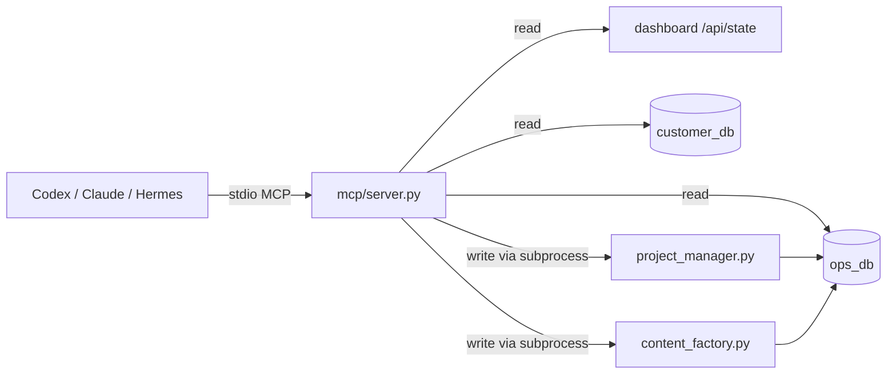
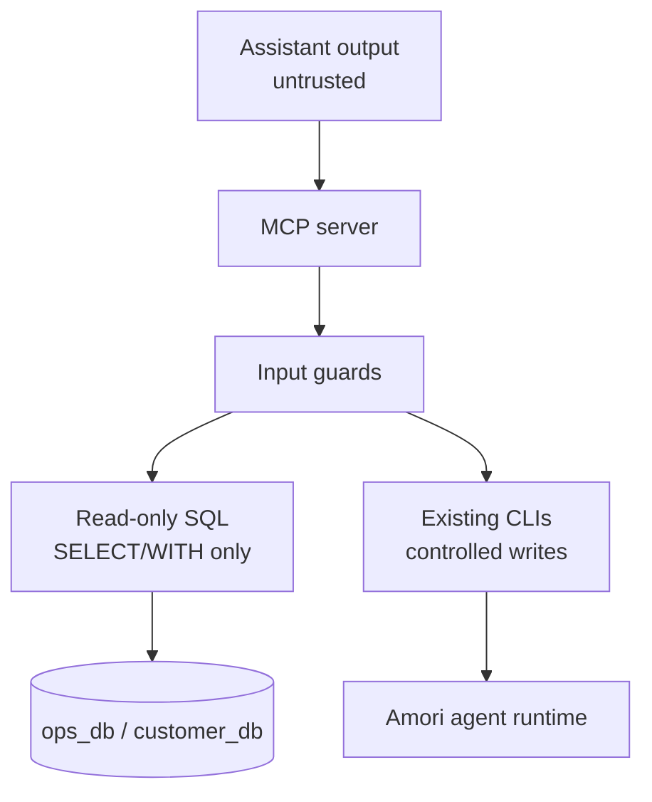

# mcp/

FastMCP stdio bridge that exposes the Amori AI operating system to local coding
assistants such as Codex, Claude Code, and Hermes.

It is a local operator bridge, not a public API. The server opens no network
port and communicates through stdio with the client process that started it.

---

## Why MCP Exists Here

Denis uses coding assistants to inspect and operate the Amori system. MCP gives
those assistants a typed tool surface instead of forcing them to scrape logs,
guess SQL, or manually run agent scripts.



Design rule: read operations are direct and lightweight; write operations reuse
the existing CLI entrypoints so MCP does not duplicate business logic or import
heavy LLM dependencies into the JSON-RPC process.

---

## Tool Surface

### Projects And Tasks

| Tool | Type | What it does |
|---|---|---|
| `new_project(goal)` | write | Decomposes a goal into queued tasks through `project_manager.py` |
| `list_projects()` | read | Lists recent projects with progress |
| `project_status(id)` | read | Lists tasks for one project |
| `list_tasks(status?)` | read | Lists queued/running/done/failed tasks |

### Content Factory

| Tool | Type | What it does |
|---|---|---|
| `create_content(brief, channel, kind)` | write | Runs copy -> visual brief -> review and creates `pending` content |
| `approve_content(id)` | write | Approves content and attempts configured external delivery |
| `reject_content(id)` | write | Rejects content |
| `list_content()` | read | Lists recent content items and statuses |

`approve_content(id)` does not guarantee publication. If Telegram is not
configured or delivery fails, the item remains `approved`; it becomes
`published` only after the Telegram API accepts the send.

### Status And Data

| Tool | Type | What it does |
|---|---|---|
| `system_status()` | read | Summarizes dashboard state, queue, content, heartbeats |
| `recent_reports(limit?)` | read | Returns recent agent reports |
| `sql_read(db, query)` | read | Runs guarded read-only SQL on `ops_db` or `customer_db` |

---

## Security Model



Guards applied to `sql_read`:

- Only `SELECT` or `WITH` queries are allowed.
- Database name must be `ops_db` or `customer_db`.
- Statements containing `;`, `DROP`, `DELETE`, `UPDATE`, `INSERT`, `TRUNCATE`,
  or `ALTER` are rejected.
- `LIMIT 200` is appended when no limit is present.
- PostgreSQL `statement_timeout` is set to 8 seconds.

The MCP process reads secrets from the same untracked local environment as the
agents. README files may document variable names but must never include values.

---

## Why Writes Use Subprocesses

Content creation and project planning call LLM providers. Importing those
modules directly inside MCP would pull in heavy dependencies and can corrupt
stdio JSON-RPC if any dependency prints to stdout.

The server therefore shells out to the existing CLIs and returns the tail of
their captured output:

```python
def _run(*args, timeout=200) -> str:
    r = subprocess.run(
        [PY, *args],
        cwd=AGENTS,
        capture_output=True,
        text=True,
        timeout=timeout,
    )
    return r.stdout[-1500:]
```

---

## Connect From Claude Code

```bash
claude mcp add agent-os -s user -- ~/ai-infra/mcp/run.sh
```

Example tool usage:

```text
use agent-os:system_status
use agent-os:new_project "prepare three Telegram posts about Amori positioning"
use agent-os:list_content
```

---

## Connect From Codex

```toml
# ~/.codex/config.toml
[mcp_servers.agent-os]
command = "/bin/bash"
args = ["-c", "~/ai-infra/mcp/run.sh"]
```

---

## Dependencies

```bash
cd ~/ai-infra/mcp
python -m venv .venv
.venv/bin/pip install "mcp[cli]" psycopg2-binary python-dotenv
```

The venv is intentionally minimal: no LiteLLM, no heavy ML packages, and no
runtime that can print uncontrolled text into the MCP protocol stream.
